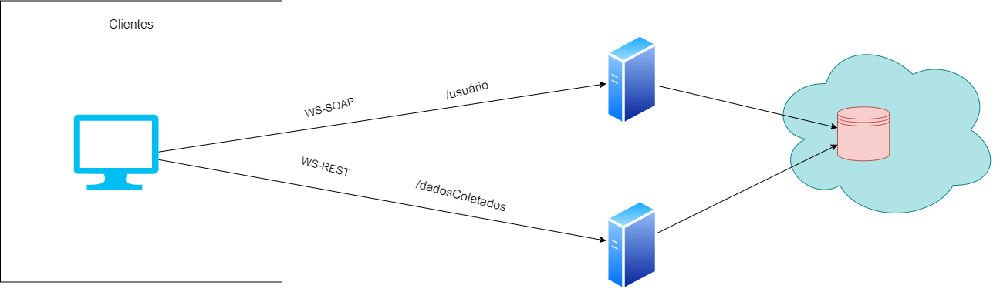
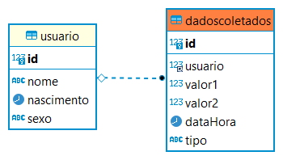

# Simulador_IoMT

Desenvolvimento de um sistema computacional que possa melhorar a qualidade de vida das pessoas e seus cuidados com a saúde.

### Serviço Web Para cadastro de usuários (Augusto)
Deverá ser desenvolvido um serviço Web, usando a linguagem python, que se comunica usando
o protocolo SOAP para realizar acesso ao Banco de Dados, especificamente a tabela de usuários. O serviço deve conter métodos que permitam a inclusão, alteração, consulta e exclusão de usuários.

### Programa para cadastro de usuários (João e Vitor)
Um programa que deverá se comunicar com o serviço web para cadastro de usuários. A
interface (gráfica/texto/web) desse programa bem como a linguagem as ser utilizada é de livre escolha. O programa deve fornecer uma forma de escolher a ação a ser realizada (menu) e proporcionar interface para que os dados possam ser manipulados.

### Serviço Web para dados gerados pelos simuladores (Augusto)
Deverá ser desenvolvido um serviço Web, usando a linguagem python, que se comunica usando
o padrão Rest para realizar acesso ao Banco de Dados, especificamente a tabela de DadosColetados. O serviço deve proporcionar a inclusão, alteração, consulta e exclusão de dados. Deve-se implementar pelo menos uma instância de cada um dos seguintes métodos do protocolo HTTP: GET, PUT, POST e DELETE.

### Simulador de sensores (William)
Implementar aplicação(ões) que simula(em) a geração de valores de dados coletados junto a
usuários por sensores, usando a linguagem python. Os dados devem ser gerados aleatoriamente, de acordo com os valores mínimo e máximo para cada medida trabalhada. Entre os dados gerados, 80% deles devem ser gerados com valores considerados “Normais” e outros 20% devem ser gerados com outros tipos de valores. O usuário deve informar como entrada ao simulador: o tipo de sensor a ser simulado, a quantidade de valores da medida a ser gerada e um valor mínimo e máximo para o intervalo em minutos entre um valor e outro a ser gerado. Os tipos de sensores estão relacionados
abaixo e os valores possíveis ao final do documento:
- Tipo 1: Pressão Arterial: gerados dois valores inteiros: pressão Sistólica (alta) e Diastólica (baixa);
- Tipo 2: SPO2: gerados dois valores inteiros: percentual de saturação e frequencia cardíaca
- Tipo 3: Temperatura Corporal: gerado um valor float. Valor2 na tabela fica vazio;

* Valores Possíveis cada uma das medidas
    - Pressão Arterial: 
        - Valores Possíveis [0, 100]
        - Sistólica [110, 129] e Diastólica [70, 84]
    - Frequência Cardíaca: 
        - Valores Possíveis [0, 200]
        - Frequência Cardíaca normal [50, 100]
    - SPO2: 
        - Valores Possíveis [0, 100]
        - Percentual de Saturação [90, 100]
    - Temperatura Corporal: 
        - Valores Possíveis [30, 45]
        - Temperatura Corporal normal [36, 37.5]

* Programa para cadastro de medidas (dadoscoletados) (João e Vitor)
Um programa que deverá se comunicar com o serviço web para dados simulados. A interface
(gráfica/texto/web) desse programa bem como a linguagem as ser utilizada é de livre escolha. O programa deve fornecer uma forma de escolher a ação a ser realizada (menu) e proporcionar interface para que os dados possam ser manipulados.

* Aplicação computacional para detectar situações específicas (William)
Criar um programa que efetue uma pesquisa entre os dados coletados, alertando para situações
específicas. Os alertas podem ser visuais na tela ou em outra interface (móvel por exemplo).
    - Situação 1: analisando os dados de um (1) usuário, caso sua temperatura corporal seja maior que 37,5 graus ou menor que 35 graus. Além disso, para caracterizar essa situação, a saturação de oxigênio no sangue (SPO2) deve ser menor que 90. Os registros de temperatura e SPO2 devem estar próximos, com no máximo 1 (uma) hora de diferença.
    - Situação 2: analisando os dados de um usuário, caso sua pressão arterial aumente pelo menos 10 pontos, na sistólica ou diastólica, em três medições consecutivas dentro de 24 horas;

### Arquitetura da Aplicação

### Arquiteura do Banco de Dados

### Tecnlogias Utilizadas
- Python
- MySQL
- VUE
- SOAP
- REST
